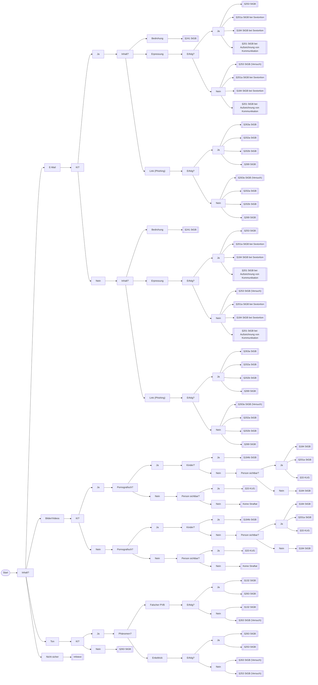

# PANDA - Polizeiliche Analyse Nichtmenschlicher Digitaler Artefakte

Ein modernes Web-Tool zur Unterstützung von Polizeibeamten bei der Erkennung KI-generierter Inhalte und rechtlichen Einordnung.

## Features

- Modernes Design 
- Vollständig responsive (Mobile & Desktop)
- Interaktiver Entscheidungsbaum
- Tipps zur Erkennung von KI-generierten Inhalten
- Automatische rechtliche Einordnung nach StGB
- Animierter Hintergrund
- eigenes Logo

## Inhaltstypen

Das Tool unterstützt die Bewertung von:
- E-Mails (Bedrohung, Erpressung/Sextortion, Phishing)
- Bildern/Videos (Pornografie, Kinderpornografie, Deepfakes)
- Audioinhalten (Falscher Polizeibeamter, Enkeltrick/Schockanruf)

## Projektstruktur

```
PANDA/
├── index.html              # HTML
├── styles/
│   ├── main.css           # Styling
│   ├── components.css     # Komponentenstyling
│   └── animations.css     # Animationen
├── js/
│   └── app-bundle.js                # Komplette gebündelte App-Logik
│       ├── AppState                 # State-Management (answers, history, progress)
│       ├── DecisionLogic            # Rechtliche Bewertung & KI-Erkennungstipps
│       ├── ScreenHelpers            # Logo Header, Back Button, Event Listeners
│       ├── NavigationController     # Screen-Wechsel mit Fade-Animationen
│       └── Screens:
│           ├── StartScreen
│           ├── ContentTypeScreen
│           ├── AICheckScreen
│           ├── UnsureHelpScreen
│           ├── EmailContentScreen
│           ├── PornographicCheckScreen
│           ├── ChildrenCheckScreen
│           ├── VictimVisibleCheckScreen
│           ├── AudioTypeScreen
│           ├── MoneyPaidScreen
│           └── ResultScreen
├── assets/
|   ├── logo-panda.svg          # Haupt-Logo (SVG)
|   ├── logo-panda.png          # Logo Fallback (PNG)
|   ├── logo-panda-white.svg    # Weiße Logo-Variante (SVG)
|   ├── logo-panda-white.png    # Weiße Logo-Variante (PNG)
|   └── logo-panda.ico          # Favicon
|   └── logo-panda-white.ico    # Weiße Favicon-Variante
├── favicon.ico         # Favicon
└── readme.md           # Readme-Datei
```

## Design & UI

### Farbschema & Schriftarten
- **Primary Color:** Pastel-Grün (#A8E6CF)
- **Schrift:** Google Fonts: Host Grotesk (Body), Cherry Bomb One (Titel)

### Animationen
- **Gradient:** 45s Farbverlauf im Hintergrund
- **Fallende Rechtecke:** Hintergrundanimation
- **Screen-Transitions:** Fade-in/Fade-out zwischen Screens
- **Button-Animationen** Hover mit Schattenwurf und Klick mit Feedback

### Responsive Design
- **Card-Breite:** Max. 600px
- **Logo-Größen:** 120px (Start), 80px (Frage-Screens)
- **Mobile-optimiert:** Touch-freundliche Button-Größen

### Logo
In Adobe Illustrator erstellt in weiß und schwarz für unterschiedliche Hintergründe.

## Browser-Kompatibilität
- Chrome/Edge (empfohlen)
- Firefox
- Safari
- Mobile Browser (iOS, Android)

## Technologien
- **JavaScript** für die Logik
- **CSS3** mit Custom Properties und Animationen
- **Responsive Design** (Flexbox, Media Queries)
- **Single-Page Application** (SPA) ohne Framework

## Nutzung
1. "Start" klicken
2. Inhaltstyp wählen (E-Mail, Bilder/Videos, Ton)
3. Fragen zum Inhalt beantworten
4. Bei "Nicht sicher": Hilfe-Screen mit Beispielen
5. Rechtliche Einordnung mit relevanten Paragraphen erhalten

## Navigation
- **Zurück-Button:** Zur vorherigen Frage zurückkehren
- **Logo-Klick:** Zum Start zurückkehren und von vorne beginnen
- **"Neue Prüfung starten":** Nach Ergebnis von vorne Beginnen


## Entscheidungspfade und Ergebnisse

### E-Mail

#### Mit KI generiert = JA
**Pfad 1: Bedrohung**
- E-Mail → KI: Ja → Inhalt: Bedrohung
- **Ergebnis:** § 241 StGB - Bedrohung

**Pfad 2: Erpressung / Sextortion**
- E-Mail → KI: Ja → Inhalt: Erpressung
- **Ergebnis:** 
  - § 253 StGB - Erpressung
  - § 201a StGB - Verletzung des höchstpersönlichen Lebensbereichs (Sextortion)
  - § 201 StGB - Verletzung der Vertraulichkeit des Wortes
  - § 184 StGB - Verbreitung pornografischer Inhalte (falls veröffentlicht)

**Pfad 3: Phishing-Link**
- E-Mail → KI: Ja → Inhalt: Link (Phishing)
- **Ergebnis:** 
  - § 263a StGB - Computerbetrug
  - § 202a StGB - Ausspähen von Daten
  - § 202b StGB - Abfangen von Daten
  - § 269 StGB - Fälschung beweiserheblicher Daten

#### Ohne KI generiert = NEIN
**Pfad 4: Bedrohung (nicht KI)**
- E-Mail → KI: Nein → Inhalt: Bedrohung
- **Ergebnis:** § 241 StGB - Bedrohung

**Pfad 5: Erpressung / Sextortion (nicht KI)**
- E-Mail → KI: Nein → Inhalt: Erpressung
- **Ergebnis:** 
  - § 253 StGB - Erpressung
  - § 201a StGB - Verletzung des höchstpersönlichen Lebensbereichs (Sextortion)
  - § 201 StGB - Verletzung der Vertraulichkeit des Wortes
  - § 184 StGB - Verbreitung pornografischer Inhalte (falls veröffentlicht)

**Pfad 6: Phishing-Link (nicht KI)**
- E-Mail → KI: Nein → Inhalt: Link (Phishing)
- **Ergebnis:** 
  - § 263a StGB - Computerbetrug
  - § 202a StGB - Ausspähen von Daten
  - § 202b StGB - Abfangen von Daten
  - § 269 StGB - Fälschung beweiserheblicher Daten

---

### Bilder / Videos

#### Mit KI generiert = JA

**Pfad 7: Kinderpornografische Inhalte**
- Bilder/Videos → KI: Ja → Pornografisch: Ja → Kinder: Ja
- **Ergebnis:** § 184b StGB - Verbreitung kinderpornografischer Inhalte

**Pfad 8: Pornografische Inhalte mit sichtbarer Person**
- Bilder/Videos → KI: Ja → Pornografisch: Ja → Kinder: Nein → Person sichtbar: Ja
- **Ergebnis:** § 184 StGB - Verbreitung pornografischer Inhalte, § 201a StGB - Verletzung des höchstpersönlichen Lebensbereichs, § 33 KUG - Recht am eigenen Bild

**Pfad 9: Pornografische Inhalte ohne sichtbare Person**
- Bilder/Videos → KI: Ja → Pornografisch: Ja → Kinder: Nein → Person sichtbar: Nein
- **Ergebnis:** § 184 StGB - Verbreitung pornografischer Inhalte

**Pfad 10: Nicht-pornografische Inhalte mit sichtbarer Person**
- Bilder/Videos → KI: Ja → Pornografisch: Nein → Person sichtbar: Ja
- **Ergebnis:** § 33 KUG - Recht am eigenen Bild

**Pfad 11: Nicht-pornografische Inhalte ohne sichtbare Person**
- Bilder/Videos → KI: Ja → Pornografisch: Nein → Person sichtbar: Nein
- **Ergebnis:** Voraussichtlich keine strafbaren Handlungen

#### Ohne KI generiert = NEIN

**Pfad 12: Kinderpornografische Inhalte (nicht KI)**
- Bilder/Videos → KI: Nein → Pornografisch: Ja → Kinder: Ja
- **Ergebnis:** § 184b StGB - Verbreitung kinderpornografischer Inhalte

**Pfad 13: Pornografische Inhalte mit sichtbarer Person (nicht KI)**
- Bilder/Videos → KI: Nein → Pornografisch: Ja → Kinder: Nein → Person sichtbar: Ja
- **Ergebnis:** § 184 StGB - Verbreitung pornografischer Inhalte, § 201a StGB - Verletzung des höchstpersönlichen Lebensbereichs, § 33 KUG - Recht am eigenen Bild

**Pfad 14: Pornografische Inhalte ohne sichtbare Person (nicht KI)**
- Bilder/Videos → KI: Nein → Pornografisch: Ja → Kinder: Nein → Person sichtbar: Nein
- **Ergebnis:** § 184 StGB - Verbreitung pornografischer Inhalte

**Pfad 15: Nicht-pornografische Inhalte mit sichtbarer Person (nicht KI)**
- Bilder/Videos → KI: Nein → Pornografisch: Nein → Person sichtbar: Ja
- **Ergebnis:** § 33 KUG - Recht am eigenen Bild

**Pfad 16: Nicht-pornografische Inhalte ohne sichtbare Person (nicht KI)**
- Bilder/Videos → KI: Nein → Pornografisch: Nein → Person sichtbar: Nein
- **Ergebnis:** Voraussichtlich keine strafbaren Handlungen

---

### Ton / Audio

#### Mit KI generiert = JA

**Pfad 17: Falscher Polizeibeamter mit Schaden**
- Ton → KI: Ja → Phänomen: Falscher Polizeibeamter → Geld bezahlt: Ja
- **Ergebnis:** § 132 StGB - Amtsanmaßung, § 263 StGB - Betrug

**Pfad 18: Falscher Polizeibeamter ohne Schaden**
- Ton → KI: Ja → Phänomen: Falscher Polizeibeamter → Geld bezahlt: Nein
- **Ergebnis:** § 132 StGB - Amtsanmaßung, § 263 StGB - Betrug (Versuch)

**Pfad 19: Enkeltrick mit Schaden**
- Ton → KI: Ja → Phänomen: Enkeltrick/Schockanruf → Geld bezahlt: Ja
- **Ergebnis:** § 263 StGB - Betrug, § 253 StGB - Erpressung

**Pfad 20: Enkeltrick ohne Schaden**
- Ton → KI: Ja → Phänomen: Enkeltrick/Schockanruf → Geld bezahlt: Nein
- **Ergebnis:** § 263 StGB - Betrug (Versuch), § 253 StGB - Erpressung (Versuch)

#### Ohne KI generiert = NEIN

**Pfad 21: Audio-Inhalte (nicht KI)**
- Ton → KI: Nein
- **Ergebnis:** § 263 StGB - Betrug (falls betrügerische Absichten vorliegen)

---

### Nicht sicher

**Was passiert bei "Nicht sicher"?**
- Nicht sicher
- **Ergebnis:** Hilfe-Screen mit Erklärungen und Beispielen für jede Kategorie:
  - **E-Mail**: Bei E-Mail-Nachrichten, Phishing-Verdacht, Bedrohungen per E-Mail
    - *Beispiele: Erpresser-Mails, Fake-Rechnungen, Phishing-Links*
  - **Bilder/Videos**: Bei Foto-/Videomaterial, Deepfake-Verdacht, manipulierten Bildern
    - *Beispiele: Manipulierte Fotos, KI-generierte Gesichter, Deepfake-Videos*
  - **Ton**: Bei Audiodateien, Voice-Cloning-Verdacht, gefälschten Anrufen
    - *Beispiele: Enkeltrick mit geklonter Stimme, falscher Polizeibeamter*
  
Nach der Hilfe kann zur Inhaltsauswahl zurückgekehrt werden.



## Rechtliche Hinweise

Dieses Tool dient als Unterstützung und ersetzt keine rechtliche Beratung oder detaillierte Prüfung durch Experten. Die angezeigten Straftatbestände sind Hinweise auf möglicherweise relevante Normen und bedürfen einer individuellen juristischen Bewertung im Einzelfall.

## Lizenz

Für den internen Gebrauch in Polizeibehörden.

